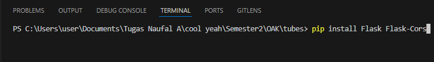
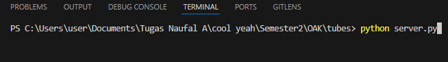
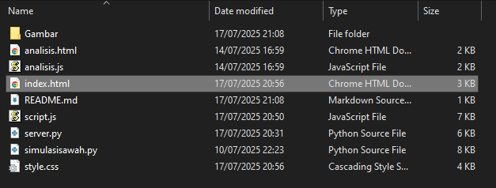

# APLIKASI SIMULASI IRIGASI SAWAH 🌱💦
Sistem aplikasi untuk simulasi monitoring kelembaban tanah sawah untuk irigasi otomatis sebagai bentuk pemenuhan tugas mata kuliah Organisasi dan Arsitektur Komputer

----

## 🔧 INSTALASI
### 1. Buka terminal lalu jalankan perintah `pip install Flask Flask-Cors`

---

### 2. Untuk menjalankan aplikasi edge gunakan perintah `python server.py` dalam terminal

---

### 3. Untuk dashboard cloud dengan membuka `index.html` menggunakan browser

---